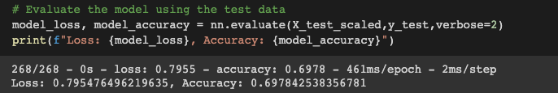

# Neural Network Charity Analysis
## Project Overview

Funding an organization carries a certain amount of risk; not every donation makes the same impact, and sometimes the money just gets lost. The purpose of this project is to predict which organizations deserve donations from Alphabet Soup, and which organizations are high risk. The data scientist in charge believes that this task is too complex for machine learning models such as logistic regression or other common statistical models. Therefore, a deep learning neural network has been considered to provide accurate results.  

### Objectives

- Create a binary classifier that can predict whether applicants will be successful if funded by Alphabet Soup.

## Preprocessing Data for a Neural Network Model
---

- Target variable for the neural network model

 I examined the dataset from Alphabet Soup and considered that the column ```IS_SUCCESSFUL``` was a variable of interest to predict if applicants were going to be low-risk. This variable became the target for the neural network model. 

- Variables considered for features

The rest of the dataset variables such as, ```APPLICATION_TYPE```, ```AFFILIATION```, ```CLASSIFICATION```, ```USE_CASE```, ```ORGANIZATION```, ```STATUS```, ```INCOME_AMT```,  ```SPECIAL_CONSIDERATIONS```, and ```ASK_AMT```, were all  initially considered features for the neural network model.  For some of those variables, I created bins for rare occurrences in their value counts, and some features were later dropped.

- Bin creation and variables removed from features

Before encoding the data, and to avoid a memory-intensive dataset for the neural network model I created bins and removed some features. 
The variables ```EIN``` and ```NAME``` didn't seem to contribute to the model's accuracy, so they were dropped first. After dropping these columns I created bins for infrequent categorical values in the following columns: ```APPLICATION_TYPE```, and ```CLASSIFICATION```. The bin *other* created for ```APPLICATION_TYPE``` was determined by observing the value counts; I decided that counts that were less than 500 for application type belonged in a bin. In the case of  ```CLASSIFICATION```, the bin was created for counts that were less than 1000. 

- Encoded values 

After removing features and creating bins, I created the OneHotEncoder instance and fitted the instance to the columns that had *object* data types in the application DataFrame. This produced a new encoded data frame called ```encoded_df``` that was later merged with ```application_df```.

## Compiling, Training, and Evaluating the Model
---

We can observe in the following image that the model created for deliverable 1 achieved an accuracy of ```0.686```.


The model's configuration comprised two hidden layers and one output layer. We can see in the image below that the first hidden layer had 80 neurons and a *relu* activation function, the second hidden layer had 30 neurons and a *relu* activation function as well. The output layer had 1 neuron and a *sigmoid* activation function.


- Neurons, layers, and activation functions selected to improve the neural network model

*Note: The following attempts to improve the model's accuracy can be found in the prototypes file.* 

The first attempt at improving the model's accuracy was to increase the number of neurons in the hidden layers. The number of neurons in the first layer was increased to 100 and the number of neurons in the second layer was increased to 45.
 


These modifications in the neural model increased the accuracy to ```0.698```. This wasn't a significant improvement, but it was clear that increasing neurons changed the model's performance,
 


Another modification to the neural model was to add a third layer. The first two layers remain unchanged with 80 and 30 neurons respectively, and 15 neurons were added to the third hidden layer.


Unfortunately these modifications decreased the accuracy to almost pure chance, that is 54%.


- Achieving target model performance

After several attempts at improving the model's accuracy by increasing or decreasing the number of neurons, or adding the number of hidden layers, I decided to investigate if I could remove other features or create more bins for infrequent values. I deleted the columns ```STATUS``` and  ```SPECIAL_CONSIDERATIONS``` because almost all values were the same for these columns. This modification didn't improve accuracy. Therefore, I decided to explore other columns for bucketing. The column ```NAME``` had several unique values, so I put the rare values into a single category. By examining the column's counts, I decided to create a replace list with value counts of less than 100.


I also changed the bucketing for ```APPLICATION_TYPE``` and ```CLASSIFICATION``` to be less 100 value counts.

These modifications increased the number of features to 78 instead of 43. 


I ran the model without modifying the initial structure and it achieved 72% accuracy as we can observe in the image below.


The following plot shows that the model achieved the maximum accuracy at around 23 epochs. 


I attempted to improve the accuracy to achieve the 75% target by increasing the number of layers, changing the activation functions or changing the number of neurons in the hidden layer, but none of those changes seemed to improve the model's performance. The following image is an example of one of several combinations used to improve the model's accuracy. 


## Neural Network Model Recommendations 
---
I believe that the neural network model could be improved to achieve higher accuracy; however, other machine learning models could be tested to see if they achieve different and better results. One recommendation is a two-class logistic regression since they are fast to train. Other models such as a two-class decision tree or boosted decision trees could also be used. 

One advantage of [boosted decision trees](https://neptune.ai/blog/gradient-boosted-decision-trees-guide) is that they improve their accuracy by relying on weak learners; the final result comes from the votes from all those learners. They are also fast to train and provide great accuracy. I think that a boosted decision tree should be the next step in building the binary classifier that will predict successful applicants. 


